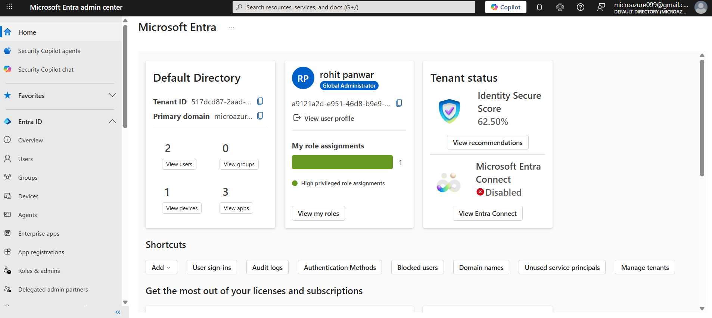
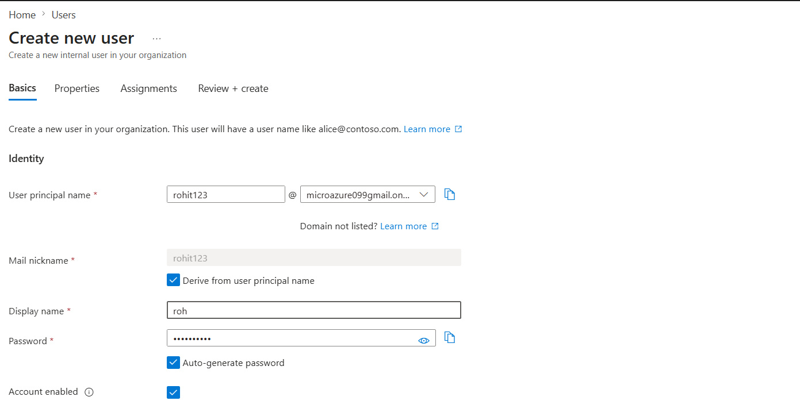
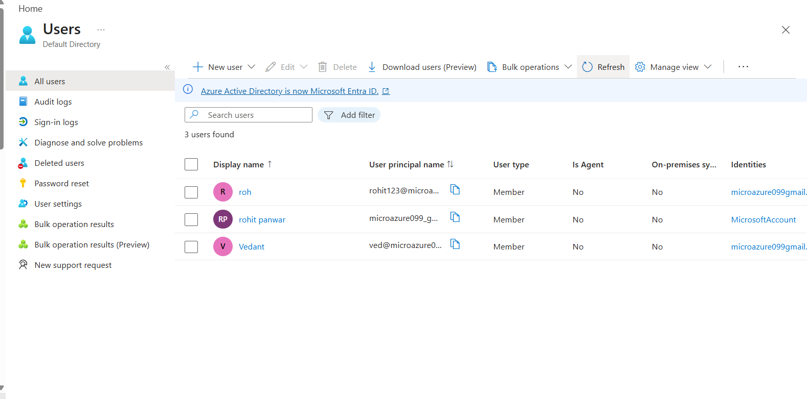
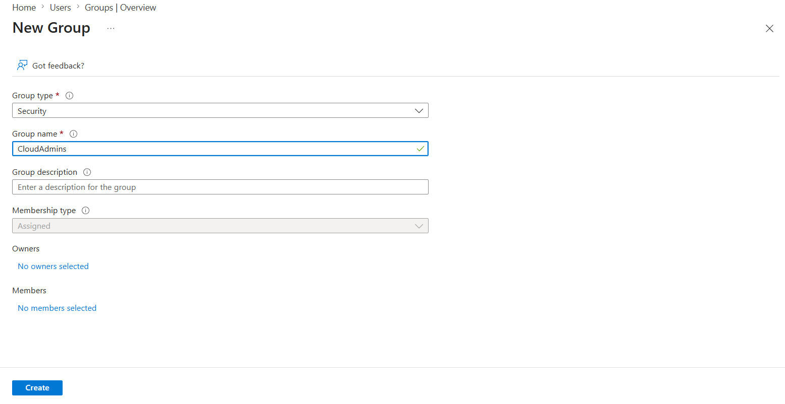
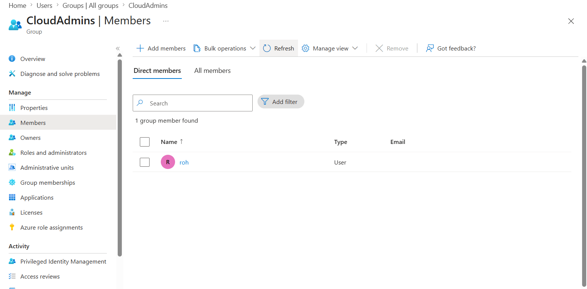
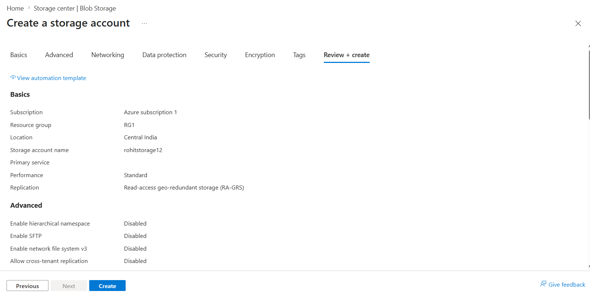
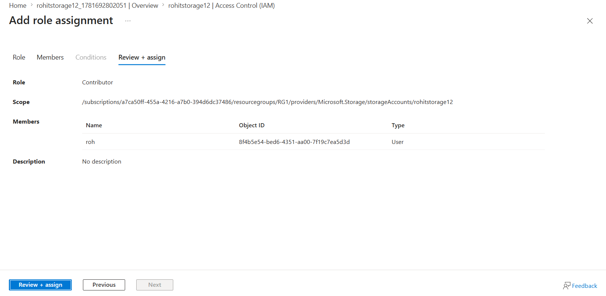
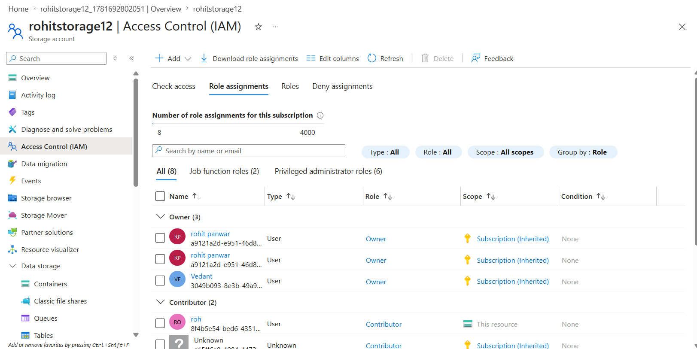

# Azure Identity & Access Management (IAM) Security Project

## 📌 Overview

This project demonstrates core **Identity and Access Management (IAM)** practices on Microsoft Azure, implemented entirely through the **Azure Portal** (no scripting/CLI used — focus is on understanding and applying Azure-native identity and access controls).

The project covers user lifecycle management, group-based access control, resource deployment, and Role-Based Access Control (RBAC) — foundational skills for any cloud security or cloud administration role.

---

## 🏗️ Architecture

```
Microsoft Entra ID
   ├── User (Created)
   ├── Security Group (CloudAdmins)
   │      └── User added as Member
   │
   └── RBAC Role Assignment
          └── Applied on → Azure Storage Account
```

---

## ✅ What This Project Covers

- Microsoft Entra ID user provisioning
- Security group creation & membership management
- Azure Storage Account deployment
- Role-Based Access Control (RBAC) via Access Control (IAM)

---

## 🔧 Step-by-Step Implementation

### 1. Microsoft Entra ID — Overview
Explored the Entra ID dashboard to understand identity management capabilities (Users, Groups, Roles) before provisioning resources.



---

### 2. User Creation
Created a new user identity in Microsoft Entra ID with a defined User Principal Name (UPN) and auto-generated password.




---

### 3. Security Group Creation
Created a **Security Group** (`CloudAdmins`) to manage access at a group level instead of assigning permissions to individual users — a best practice for scalable access management.



---

### 4. Adding User to Group
Added the created user as a member of the `CloudAdmins` security group.



---

### 5. Storage Account Deployment
Deployed an Azure Storage Account to act as the target resource for access control testing.



---

### 6. RBAC Role Assignment
Used **Access Control (IAM)** on the storage account to assign the **Contributor** role to the security group, granting members the appropriate level of access without managing permissions per-user.




---

## 🔐 Key Concepts Demonstrated

- **Identity lifecycle management** — creating and managing user identities in Entra ID
- **Group-based access control** — assigning permissions to groups rather than individuals (principle of least privilege at scale)
- **RBAC (Role-Based Access Control)** — controlling who can do what on a specific Azure resource
- **Azure Portal-based governance** — hands-on familiarity with the Azure console for identity and access tasks

---

## 🛠️ Tools & Services Used

- Microsoft Entra ID
- Azure Storage Account
- Azure Access Control (IAM)
- Azure Portal

---

## 🚧 Future Enhancements (Planned)

The following were studied as part of this learning path and are planned for a future iteration of this project:

- Multi-Factor Authentication (MFA) enforcement on user accounts
- Conditional Access Policies for adaptive, risk-based security

